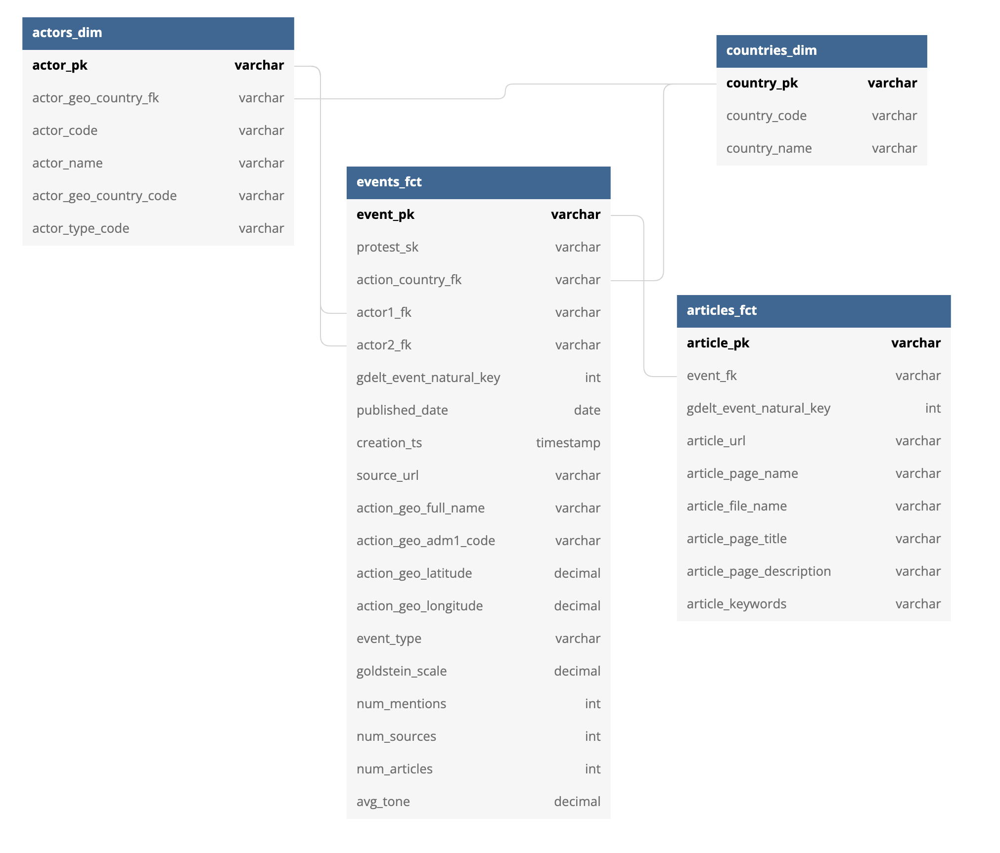
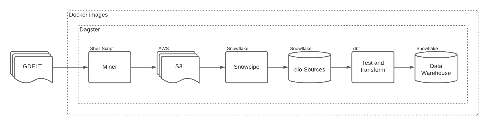
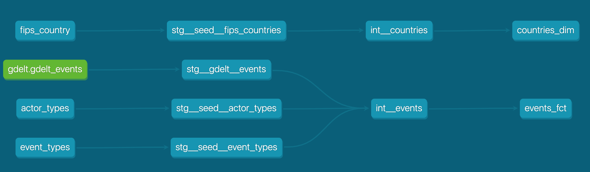

# What is the discursus project
The discursus project is an open source platform that mines, shapes and exposes the digital artifacts of protests, their discourses and the actors that influence social reforms.

[For a full intro, read here](https://www.olivierdupuis.com/introducing-discursus-io/)

# Current Status
ERD:

Stack:

dbt DAG:

# Environment
* Set environment variables
    * Rename the `Dockerfile_pipelines.REPLACE` file to `Dockerfile_pipelines`
    * Change the values of environment variables within
* Make any necessary changes to docker-compose
    * This depends on your docker contexts for `docker compose up`
    * Current version is to run locally

# Run Docker stack locally
* `docker compose -p "discursus-data-stack" --file docker-compose.yml up --build`

# Visit Dagster's app
* Go to `http://127.0.0.1:3000/`
