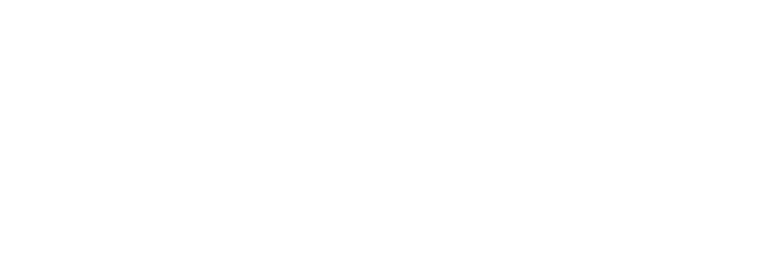
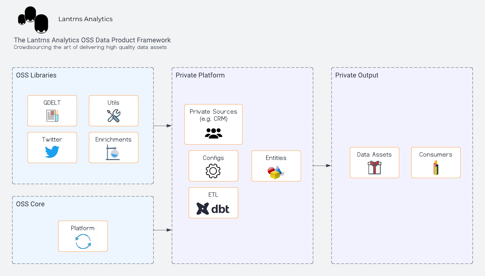

  

    <a href="https://www.lantrns.co/">Website</a> |
    <a href="https://twitter.com/lantrns_co">Twitter</a> |
    <a href="https://www.linkedin.com/company/lantrns-co/">LinkedIn</a>
      
    
    
    
    
    

# The Social Analytics Framework

The OSS __Social Analytics Framework__ provides an architecture and suite of librairies to quickly start sourcing, transforming and delivering high quality public social signals to your users.

&nbsp;

## Implementations

We use this framework for [discursus](https://github.com/lantrns-analytics/discursus_data_platform), which is an open source social analytics data product that continuously deliver data on protest movements throughout North America.. 

Below is an overview of what this data product's flow of data asset transformations looks like.

&nbsp;

## Architecture

For the discursus project above, we rely on the following architecture to support our instance.

Here are the components of this implementation:

- A suite of miners that sources social public signals such as GDELT and Twitter.
- Cloud storage such as S3.
- Data preparation libraries to repair and enhance data.
- Data transfer capabilities such as Snowpipe, to move data between cloud storage and cloud data warehouses.
- dbt transformations to build and package data assets.
- Semantic layer definition automations, to expose data assets.
- API and BI tool layers to consume data assets and serve them to end users.
- A Dagster app that orchestrates the creation of data assets.

&nbsp;

## Installation
To use the __Social Analytics Framework__, you will need to:
- Fork this  repo.
- Set up your accounts to service all the components of your own architecture (app hosting, cloud storage, data warehouse, etc.).
- Configuration of the Docker definitions:
    - Rename the `Dockerfile_app.REPLACE` file to `Dockerfile_app`.
    - Change the values of environment variables within the `Dockerfile_app` file.
    - Make any necessary changes to `docker-compose`
- To run the Docker stack locally: `docker compose -p "dpf-core" --file docker-compose.yml up --build`
- Visit Dagster's app: `http://127.0.0.1:3000/`

&nbsp;

## Libraries
Libraries are [resources](https://docs.dagster.io/concepts/resources) used within your own instance of the framework. Resources usually require [configurations](https://docs.dagster.io/concepts/configuration/config-schema#run-configuration).

We assume you are running a Docker file such as the one we have in the [Core repo](https://github.com/lantrns-analytics/dpf_core/blob/release/0.1/Dockerfile_app.REPLACE). Let's say we wanted to add the GDELT library, the only thing you need to add is the following.

`RUN pip3 install git+https://github.com/lantrns-analytics/saf_gdelt@release/0.2`

Please visit the following library repos for more information on how to use each of them:
- [AWS](https://github.com/lantrns-analytics/saf_aws)
- [GDELT](https://github.com/lantrns-analytics/saf_gdelt)
- [Web Scraper](https://github.com/lantrns-analytics/saf_web_scraper)
- [Novacene AI](https://github.com/lantrns-analytics/saf_novacene)

&nbsp;

## Contributing

There are many ways you can contribute and help evolve the __Lantrns Analytics open-source data product framework__. Here a few ones:

* Star this repo.
* Fork this repo and run an instance yourself and please 🙏 help us out with documentation.
* Take ownership of some of the [issues we already documented](https://github.com/lantrns-analytics/dpf_core/issues), and send over some PRs.
* Contribute to the libraries.
* Create issues every time you feel something is missing or goes wrong.

All sort of contributions are **welcome and extremely helpful** 🙌 

&nbsp;

## License

The __Social Analytics Framework__ is [MIT licensed](./LICENSE.md).
