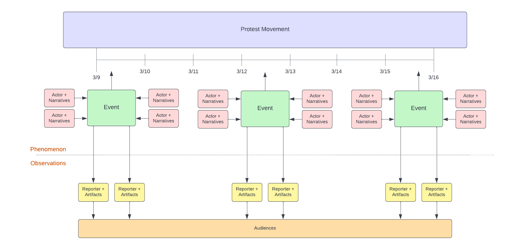
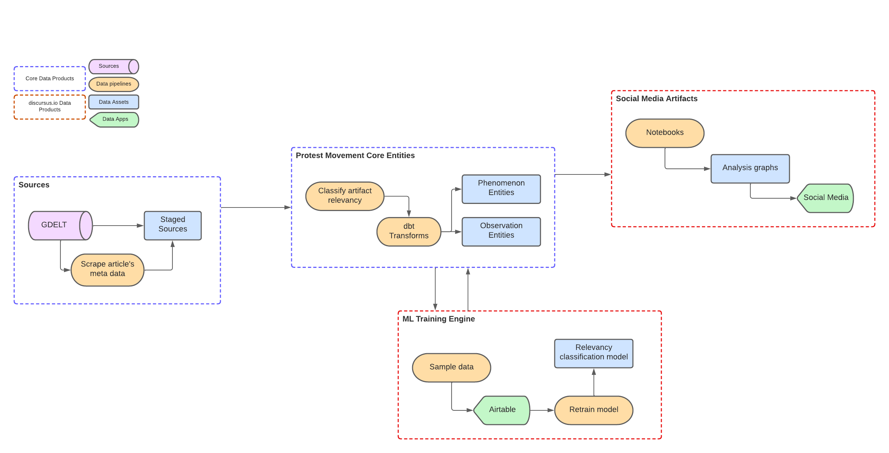
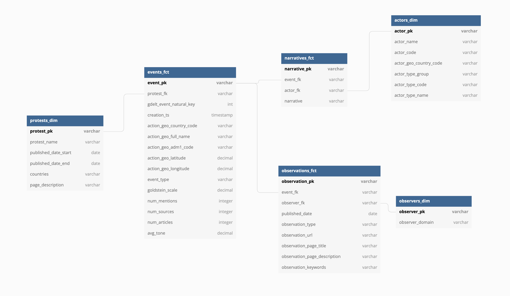
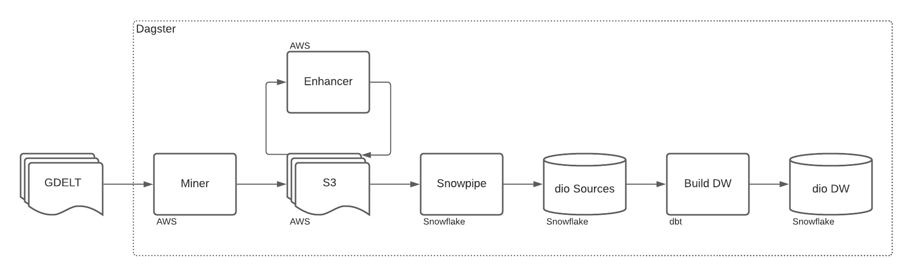

  

    <a href="https://discursus.substack.com/">Newsletter</a> |
    <a href="https://twitter.com/discursus_io">Twitter</a>
      
    
    
    

# What is the discursus core platform?

Protest movements are powerful dynamics between citzens and institutions. Behind the physical manifestation of protests are discourses that morphes. They are incubators of ideas. Like viruses that mutate, spread and can change our collective ethos.

Protest events are important to understand, as they confronts us as a society and leads to healthier and more vibrant democracies. The problem is that they are hard to observe, study and analyse.

__The discursus project is an open source data platform__ that mines, shapes and exposes the digital artifacts of protests, their discourses and the actors that influence social reforms.

[For a full introduction, read here](https://discursus.substack.com/p/introducing-the-discursus-project-b98ac9388621?s=w)

&nbsp;

# Phenomenon Abstraction

The first image is the abstraction that would roughly represent the domain we're trying to map with discursus. The top layer is the protest movement phenomenon itself, whereas the bottom layer is how that phenomenon is being reported. 

# Data Platform

discursus builds a few data products which ultimately exposes data assets that are either consumed directly by end users, or becomes sources for other data products.

The following entities are exposed as the final output of our architecture.

&nbsp;

# Architecture

Here are the main components of the discursus core architecture:

- A miner that sources events from the [GDELT project](https://www.gdeltproject.org/) and saves it to AWS S3.
- An enhancement process that scrapes the article's metadata and saves it to AWS S3.
- An ML enrichment process that classifies article's relevancy using a custom ML algorithm hosted on [Novacene.ai](https://novacene.ai/) and saves results to AWS S3.
- A suite of snowpipes that loads S3 data to Snowflake.
- A dbt project that creates a data warehouse which exposes protest events.
- A Dagster app that orchestrates all data transformation jobs and the creation of assets.

&nbsp;

# Installation
Spinning up your own discursus instance still isn't a breeze. But we know how important it is and are working on making our architecture and documentation more robust to that effect.

For now, to spin up an instance of discursus Core, you will first need to have your own external service accounts in place:
- An AWS S3 bucket to hold the events, articles and enhancements.
- An AWS ec2 instance to run discursus.
- A Snowflake account to stage data from S3, perform transformations of data and expose entities.
- A Novacene.ai account to perform ML enrichments.

On Snowflake, you will need to create a few objects prior to running your instance:
- Source tables to stage the mined events.
- Snowpipes to move data from S3 to your source tables.
- File formats for Snowflake to read the source S3 csv files properly.

Once you have all those in place, you can fork the discursus Core repo.

Only thing left is to configure your instance:
- Rename the `Dockerfile_app.REPLACE` file to `Dockerfile_app`.
- Change the values of environment variables within the `Dockerfile_app` file.
- Make any necessary changes to `docker-compose`
- To run the Docker stack locally: `docker compose -p "discursus-data-platform" --file docker-compose.yml up --build`
- Visit Dagster's app: `http://127.0.0.1:3000/`

Of course [reach out directly to me](mailto:olivier@discursus.io) if you need any help implementing your own instance of discursus core.

&nbsp;

# Contributing

There are many ways you can contribute and help discursus core. Here a few ones:

* Star this repo, subscribe to our [newsletter](https://discursus.substack.com/) and follow us on [Twitter](https://twitter.com/discursus_io).
* Fork this repo and run an instance yourself and please 🙏 help us out with documentation.
* Take ownership of some of the [issues we already documented](https://github.com/discursus-io/discursus_core/issues), and send over some PRs
* Create issues every time you feel something is missing or goes wrong.

All sort of contributions are **welcome and extremely helpful** 🙌 

&nbsp;

# License

discursus core is [MIT licensed](./LICENSE.md).
